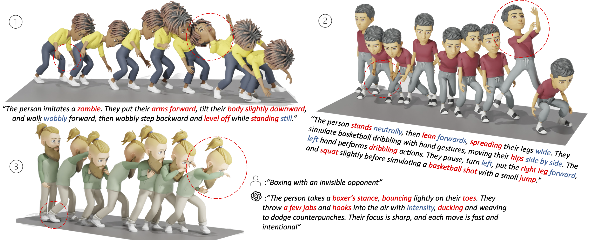

# OmniMotion: Human Motion Generation from Expressive Texts

<p align="left">
  <a href=''>
    </a>
  <a href=''>
    </a>
  <a href=''>
    </a>
</p>



If you find our code or paper helpful, please consider starring our repository and citing:
```
xxx
```

## :postbox: News

📢 **2023-11-29** --- Initialized the webpage and git project.

## :round_pushpin: Get You Ready

  
### 1.1 Conda Environment
  
```sh
conda env create -f environment.yml
conda activate momask-plus
```

#### Alternative: 
In case you have trouble installing by Conda, you can still install through pip.

```sh
pip install -r requirements.txt
```

We tested this with Python 3.8.20.

### 1.2 Models and Dependencies

#### Download Pre-trained Models
```
bash prepare/download_models.sh
```

#### Download Evaluation Models and Gloves
For evaluation only.
```
bash prepare/download_evaluator.sh
bash prepare/download_glove.sh
```

#### Troubleshooting
To address the download error related to gdown: "Cannot retrieve the public link of the file. You may need to change the permission to 'Anyone with the link', or have had many accesses". A potential solution is to run `pip install --upgrade --no-cache-dir gdown`, as suggested on https://github.com/wkentaro/gdown/issues/43. This should help resolve the issue.

#### (Optional) Download Manually
Visit [[Google Drive]](https://drive.google.com/drive/folders/1sHajltuE2xgHh91H9pFpMAYAkHaX9o57?usp=drive_link) to download the models and evaluators mannually.

### 1.3 Get Data

**HumanML3D** - Follow the instruction in [HumanML3D](https://github.com/EricGuo5513/HumanML3D.git), then copy the dataset to our repository:

```
cp -r ./HumanML3D/ ./data/humanml3d
```

**OmniMotion** - Download the data from [huggingface](https://huggingface.co/datasets/Ericguo5513/OmniMotion), then copy the dataset to our repository:

```
cp -r ./OmniMotion ./data/omnimotion
```

## :rocket: Play with Pre-trained Model

### 2.1 Generation 

If you want to generate motions given your own text, try ``gen_momask_plus.py``:

```
python gen_momask_plus.py
```

Check ``config/eval_momaskplus.yaml`` for inference configration such as ``number of steps`` and ``guidance scale``.

### 2.2 Evaluation

Run the following scripts for quantitive evaluation:

```sh
python eval_momask_plus_hml.py          # Evaluation on HumanML3D dataset
python eval_momask_plus.py              # Evaluation on OmniMotion dataset
```

### 2.3 Training

There are two main components in MoMask++, a multi-scale residual motion VQVAE and a generative masked Transformer.

#### Multi-scale Motion RVQVAE

```sh
python train_rvq_hml.py                 # Training multiscale RVQ on HumanML3D dataset.
python train_rvq.py                     # Training multiscale RVQ on OmniMotion dataset.
```

Find the learning configurations in 'config/residual_vqvae_hml.yaml' for HumanML3D and 'config/residual_vqvae.yaml' for OmniMotion.

#### Generative Masked Transformer

```sh
python train_momask_plus_hml.py         # Training Transformer on HumanML3D dataset.
python train_momask_plus.py             # Training Transformer on OmniMotion dataset.
```

#### Global Motion Refinement

We use a separate lightweight root motion regressor to refine the root trajectory. In particular, this regressor is trained given local motion features to predict root linear velocities. During motion generation, we use this regressor to re-predict the resulting root trajectories which effectively reduces sliding feet.

## :clapper: Visualization

All animations are manually rendered in blender using Bitmoji characters. An example character is provided [Here](xxx). We use this [scene](xxxx) for animation.

### Retargeting

We recommend rokoko belender [add-on](https://www.rokoko.com/integrations/blender) (v1.4.1) for seamless retargeting. Please note all motions in OmniMotion are T-Posed in rest pose. You can use script ``rest_pose_retarget.py`` for conversion betweening ``T-Pose`` and ``A-Pose`` rest pose.

## Acknowlegements

We sincerely thank the open-sourcing of these works where our code is based on: 

[MoMask](https://github.com/EricGuo5513/momask-codes), [VAR](https://github.com/FoundationVision/VAR), [deep-motion-editing](https://github.com/DeepMotionEditing/deep-motion-editing), [Muse](https://github.com/lucidrains/muse-maskgit-pytorch), [vector-quantize-pytorch](https://github.com/lucidrains/vector-quantize-pytorch), [T2M-GPT](https://github.com/Mael-zys/T2M-GPT), [MDM](https://github.com/GuyTevet/motion-diffusion-model/tree/main) and [MLD](https://github.com/ChenFengYe/motion-latent-diffusion/tree/main)

### Misc
Contact guochuan5513@gmail.com for further questions.
